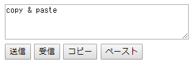

# online clip board

サーバーに文字列をポストして、複数の端末上でクリップボード的な使い方をするプログラム。herokuにそのままデプロイできるので個人用に使える !
```
使用例 https://hrclipboard.herokuapp.com/
```


## init
```
npm i -g yarn
yarn install
```

build
```
yarn run build
```

run
```
yarn run start
```
